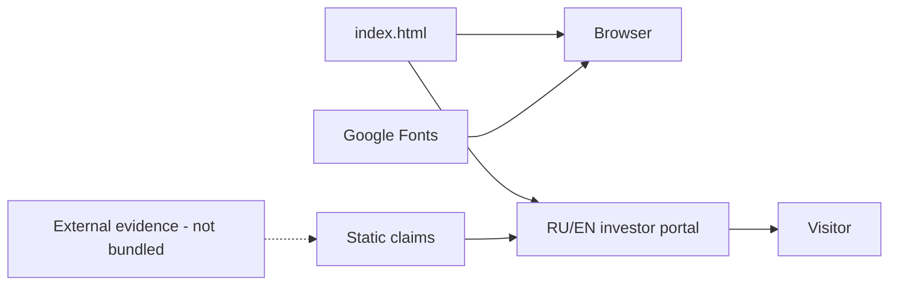

# 🌐 SHTENCO QUANT AI TECH — verified static-portal dossier

> **Статус:** 🟡 PRESENTATION / INVESTOR-PITCH STATIC SITE.
> **Проверено по фактическому `main`:** 29.09.2026.
> **Ключевое правило:** числовые и performance-claims внутри `index.html` считаются presentation claims, пока на них нет отдельного воспроизводимого evidence.

## 1. 🎯 Назначение репозитория

`shtencoauantai.github.io` — статический RU/EN web-портал, представляющий Quant/AI направление, MIDAS AI и инвестиционную концепцию.

Этот repository является **presentation surface**. Он не содержит hedge-fund runtime, торговый engine, model training pipeline, quantum backend или audited investment ledger.

## 2. 📦 Фактическое дерево `main`

```text
shtencoauantai.github.io/
├── README.md
└── index.html
```

На текущем `main` отсутствуют:

- tests;
- CI workflow;
- build system;
- backend;
- API;
- model code;
- benchmark data;
- investment evidence package;
- deployment manifest.

`index.html` — крупная single-file HTML/CSS/JS страница размером около 55 KB.

## 3. 🖥️ Что реально реализовано

В `index.html` есть:

- RU/EN переключатель;
- responsive layout;
- sticky navigation;
- animated neural-network canvas;
- investment section;
- technology section;
- roadmap section;
- contact blocks;
- scroll reveal/animations;
- external Google Fonts;
- background audio element;
- static marketing metrics and claims.

Это реальный UI-код, который можно открыть в браузере.

## 4. 🚨 Evidence boundary для claims

Страница содержит, среди прочего, такие presentation claims:

- fundraising target `$10M`;
- IP valuation `$50M`;
- target/expected returns `45–65%`;
- `12` neural networks;
- `85K` lines of code;
- `500M` data units per day;
- IBM/quantum-related descriptions;
- fund launch/AUM roadmap.

**Этот repository сам по себе не содержит evidence**, подтверждающего эти цифры.

Поэтому каноническая трактовка:

```text
number in HTML
!=
audited engineering evidence
!=
legal investment representation
!=
realized performance
```

Для каждого такого claim нужен отдельный source/evidence artifact в authoritative repository.

## 5. 🏗️ Архитектура текущего repo



Это полностью client-side presentation chain.

## 6. 📥 Inputs

Фактические inputs:

- committed HTML/CSS/JS;
- Google Fonts over network;
- browser viewport/events;
- user language selection;
- scroll/click interactions.

Нет фактического market-data/API input в этом repository.

## 7. 📤 Outputs

- rendered RU/EN page;
- visual metrics/cards;
- investment/technology presentation;
- client-side animation state;
- links/contact navigation.

Ни один output не является trading signal или financial statement.

## 8. ⚠️ Найденный asset issue

HTML содержит:

```html
<audio id="background-music" autoplay loop>
  <source src="000999.mp3" type="audio/mpeg">
</audio>
```

Но в root tree текущего `main` файла `000999.mp3` **нет**.

Следовательно background-audio dependency сейчас unresolved и при обычной статической публикации должна давать missing-asset/404 behavior.

Это пример того, почему README должен опираться на фактическое дерево.

## 9. 🛡️ Authority boundaries

```text
static return target       != realized return
backtest claim             != live P&L
HTML valuation             != independent valuation
fundraising copy           != executed investment round
quantum wording            != quantum advantage
displayed neural count     != verified deployed models
site technology section    != source-code implementation
```

Portal не должен становиться source of truth для engineering maturity.

## 10. 🔐 Security / privacy model

Текущий сайт статический. Основные требования:

- никаких private API keys в HTML;
- никаких broker credentials;
- никаких investor private records;
- никаких production wallet/private keys;
- external resources должны быть минимизированы/зафиксированы;
- ссылки должны проходить automated check;
- contact forms, если будут добавлены, требуют backend/privacy model;
- investment-related content должен иметь clear evidence/disclaimer boundary.

## 11. ⚠️ Failure modes

| Failure | Последствие |
|---|---|
| устаревшая статическая цифра | вводит читателя в заблуждение о текущем статусе |
| performance claim без evidence | невозможно воспроизвести |
| missing audio asset | console/network error |
| broken external font | visual degradation |
| JS language switch regression | часть контента недоступна |
| one-file architecture grows | review становится сложным |
| нет automated link check | stale external URLs |
| marketing status diverges from federation | два источника истины |

## 12. 🧪 Required validation suite

Для превращения portal в verified presentation artifact нужны:

- HTML validator;
- broken-link checker;
- missing-asset checker;
- RU/EN parity check;
- mobile viewport smoke;
- Lighthouse/accessibility smoke;
- no-secret scan;
- claim manifest;
- evidence-link resolver;
- screenshot regression;
- CSP review.

## 13. 📊 Claim-to-evidence model

Следующий правильный формат:

```json
{
  "claim_id": "midas-target-return",
  "display_value": "45-65%",
  "claim_type": "target",
  "evidence_status": "UNVERIFIED_PRESENTATION",
  "source_repository": "Shtenco/synergy_midas_ai",
  "evidence_url": null,
  "last_verified": null
}
```

UI должен отличать:

- historical measured;
- backtest;
- target;
- estimate;
- third-party statement;
- roadmap;
- unverified presentation.

## 14. 🛠️ Воспроизводимость

Текущий сайт можно воспроизвести локально:

```bash
git clone https://github.com/Shtenco/shtencoauantai.github.io.git
cd shtencoauantai.github.io
python -m http.server 8000
```

После этого открыть localhost:8000.

Нужно ожидать, что `000999.mp3` не загрузится, пока asset отсутствует.

## 15. 🗺️ Карта репозитория

| Путь | Назначение |
|---|---|
| `index.html` | весь static portal |
| `README.md` | verified technical dossier |
| `000999.mp3` | referenced by HTML, ❌ отсутствует |
| `.github/workflows/` | ❌ отсутствует |
| `tests/` | ❌ |
| `evidence/` | ❌ |
| backend | ❌ |

## 16. 🔗 Место в SYNERGY

Это public presentation surface, связанный по тематике с:

- [`synergy_midas_ai`](https://github.com/Shtenco/synergy_midas_ai);
- [`synergy_midas_institutional`](https://github.com/Shtenco/synergy_midas_institutional);
- [`synergy_quantlab`](https://github.com/Shtenco/synergy_quantlab);
- [`synergy_system`](https://github.com/Shtenco/synergy_system).

Связь тематическая/presentation и **не доказывает runtime dependency**.

## 17. 📊 Evidence maturity

| Layer | Status |
|---|---|
| static portal source | ✅ |
| RU/EN interface | ✅ |
| responsive styling | ✅ |
| automated tests | ❌ |
| CI/deploy evidence | ❌ |
| claim-to-evidence mapping | ❌ |
| verified performance figures | ❌ in this repo |
| hedge-fund runtime | ❌ |
| model runtime | ❌ |

## 18. 🚀 Roadmap

1. убрать/добавить missing audio asset;
2. добавить CI static checks;
3. сформировать claims manifest;
4. связать claims с authoritative evidence;
5. разделить target / measured / backtest / estimate;
6. link checker;
7. RU/EN parity test;
8. accessibility/Lighthouse;
9. split CSS/JS/content при дальнейшем росте;
10. автогенерировать status badges из federation registry.

## 19. 🛑 Что project НЕ доказывает

- реальную оценку IP;
- будущую/гарантированную доходность;
- факт привлечения инвестиций;
- AUM;
- quantum advantage;
- количество production neural models;
- размер production codebase;
- обработку указанного объёма данных;
- legal/regulated fund status.

Такие утверждения должны подтверждаться отдельно и не выводятся из существования страницы.

---

[🧭 SYNERGY SYSTEM](https://github.com/Shtenco/synergy_system) · [📚 Атлас 75 репозиториев](https://github.com/Shtenco/synergy_system/blob/main/docs/SYNERGY_REPOSITORY_ATLAS.md) · [🧾 Registry](https://github.com/Shtenco/synergy_system/blob/main/registry/SYNERGY_REPOSITORIES.json)
