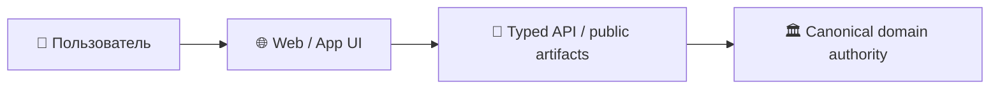

# 🌐 Shtenco AI / SYNERGY Web Portal

> **Роль:** Публичный статический presentation-layer для отдельных направлений AI/SYNERGY.  
> **Архитектурный родитель:** [`synergy_apps`](https://github.com/Shtenco/synergy_apps)

## 🎯 Назначение

Публичный статический presentation-layer для отдельных направлений AI/SYNERGY.

Этот репозиторий относится к presentation/application слою. Он не должен становиться вторым бухгалтерским ledger, платёжным authority или источником истины для backend-состояния.



## 🛡️ Инварианты

```text
UI state            != accounting truth
static page         != backend runtime
displayed metric    != audited metric
client-side success != settlement
```

## 🔗 Федерация

- [SYNERGY SYSTEM](https://github.com/Shtenco/synergy_system)
- [SYNERGY Apps](https://github.com/Shtenco/synergy_apps)
- [Атлас всех 75 репозиториев](https://github.com/Shtenco/synergy_system/blob/main/docs/SYNERGY_REPOSITORY_ATLAS.md)
- [Машиночитаемый реестр](https://github.com/Shtenco/synergy_system/blob/main/registry/SYNERGY_REPOSITORIES.json)

## 🚀 Roadmap документации

- [ ] описать фактическую структуру сайта/приложения;
- [ ] добавить data-flow diagram;
- [ ] зафиксировать источники публичных данных;
- [ ] добавить privacy/security notes;
- [ ] автоматизировать проверку битых ссылок;
- [ ] связывать claims с evidence artifacts.
