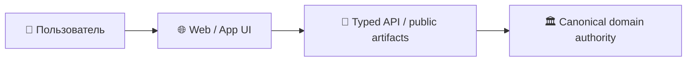
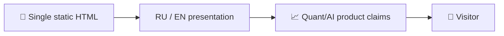

# 🌐 Shtenco AI / SYNERGY Web Portal

> **Роль:** Публичный статический presentation-layer для отдельных направлений AI/SYNERGY.  
> **Архитектурный родитель:** [`synergy_apps`](https://github.com/Shtenco/synergy_apps)

## 🎯 Назначение

Публичный статический presentation-layer для отдельных направлений AI/SYNERGY.

Этот репозиторий относится к presentation/application слою. Он не должен становиться вторым бухгалтерским ledger, платёжным authority или источником истины для backend-состояния.



## 🛡️ Инварианты

```text
UI state            != accounting truth
static page         != backend runtime
displayed metric    != audited metric
client-side success != settlement
```

## 🔗 Федерация

- [SYNERGY SYSTEM](https://github.com/Shtenco/synergy_system)
- [SYNERGY Apps](https://github.com/Shtenco/synergy_apps)
- [Атлас всех 75 репозиториев](https://github.com/Shtenco/synergy_system/blob/main/docs/SYNERGY_REPOSITORY_ATLAS.md)
- [Машиночитаемый реестр](https://github.com/Shtenco/synergy_system/blob/main/registry/SYNERGY_REPOSITORIES.json)

## 🚀 Roadmap документации

- [ ] описать фактическую структуру сайта/приложения;
- [ ] добавить data-flow diagram;
- [ ] зафиксировать источники публичных данных;
- [ ] добавить privacy/security notes;
- [ ] автоматизировать проверку битых ссылок;
- [ ] связывать claims с evidence artifacts.


---

# 🌐 Глубокий технический паспорт Quant AI портала

## Фактический `main`

Репозиторий состоит из `README.md` и одного крупного `index.html`. Страница позиционирует SHTENCO QUANT AI TECH, имеет RU/EN переключатель, sticky navigation, hero, продуктовые/исследовательские секции и интенсивную CSS-визуализацию.



## Что является реальным артефактом

Реальным артефактом этого repo является **публичная статическая витрина**. Она не является hedge-fund runtime, trading engine или benchmark authority.

## Failure modes

- marketing copy может опережать состояние кода;
- двуязычные блоки могут рассинхронизироваться;
- встроенные числа не имеют автоматической связи с MIDAS evidence;
- single-file архитектура усложняет review и regression testing.

## Следующий рубеж

- data-driven project cards из federation registry;
- evidence badges с прямыми ссылками;
- automated RU/EN consistency check;
- Lighthouse/accessibility smoke;
- отделение marketing claims от measured engineering metrics.
